# Carbon-Trace: Presentation Guide

> **Comprehensive slide deck outline for presenting the Carbon-Trace Industrial Emission Auditor project**

---

## 📋 Presentation Outline

| # | Slide Title | Duration | Purpose |
|---|------------|----------|---------|
| 1 | Title Slide | 30s | Project introduction |
| 2 | Problem Statement | 1m | Why carbon auditing matters |
| 3 | SDG 13: Climate Action | 1m | UN sustainability context |
| 4 | Our Solution: Carbon-Trace | 1m | High-level overview |
| 5 | System Architecture | 1.5m | Tech stack & components |
| 6 | The Closure Pattern | 2m | Core curriculum focus |
| 7 | Why Closures? | 2m | Benefits over alternatives |
| 8 | Data Flow & Pipeline | 1.5m | End-to-end workflow |
| 9 | Live Demo | 3m | Application walkthrough |
| 10 | Testing & Validation | 1m | Test suite coverage |
| 11 | Key Learnings | 1m | What we learned |
| 12 | Future Enhancements | 30s | Roadmap ideas |
| 13 | Q&A | 2m | Questions |

**Total Duration: ~15-18 minutes**

---

## 🎯 Slide-by-Slide Content

---

### Slide 1: Title Slide

**Title:** Carbon-Trace: Industrial Emission Auditor

**Subtitle:** Demonstrating Python Closures for Secure State Management

**Visual Elements:**
- Carbon-Trace logo concept (leaf + bar chart)
- UN SDG 13 badge
- Team member names

**Speaker Notes:**
> "Good [morning/afternoon]. We're presenting Carbon-Trace — a full-stack carbon emission auditing platform that demonstrates how Python closures can provide secure, isolated state management for industrial applications."

---

### Slide 2: Problem Statement

**Title:** The Carbon Accountability Challenge

**Key Points:**
- Industries produce ~21% of global greenhouse gas emissions
- Steel, Textile, and Electronics sectors have vastly different emission profiles
- Current auditing systems often use:
  - Global variables (insecure, prone to cross-contamination)
  - Basic classes (data can be externally mutated)
  - Centralized databases (complex, overhead)

**Quote Block:**
> "To combat climate change, industries must adopt precise, verifiable carbon auditing systems."

**Visual:** Icons showing 🏭 → 💨 → 🌡️ (factory → emissions → warming)

**Speaker Notes:**
> "The problem is clear: different industrial sectors — Steel, Textile, Electronics — operate under completely different production methods and emission factors. A steel plant might emit 1,850 kg of CO₂ per ton of production, while a textile factory emits just 450 kg. Current tracking systems often use global variables or simple classes where data can be accidentally or maliciously modified. We needed a more secure approach."

---

### Slide 3: SDG 13 — Climate Action

**Title:** Aligned with Global Climate Goals

**UN SDG 13 Targets:**
- 🎯 Target 13.2: Integrate climate measures into policies
- 🎯 Target 13.3: Improve awareness and capacity on climate mitigation

**How Carbon-Trace Contributes:**
```
┌─────────────────────────────────────────────────────┐
│                 CARBON-TRACE IMPACT                 │
├─────────────────────────────────────────────────────┤
│  📊 MEASURE  →  Track emissions across 50+ factories│
│  🚨 MONITOR  →  Real-time carbon cap violation alerts│
│  📉 REDUCE   →  Identify high-emission targets      │
│  ✅ VERIFY   →  Auditable, tamper-proof records     │
└─────────────────────────────────────────────────────┘
```

**Speaker Notes:**
> "Our project directly supports UN Sustainable Development Goal 13 — Climate Action. Specifically, we're enabling industries to measure their emissions accurately, monitor compliance with carbon caps, and identify which factories need immediate attention. The key innovation is that our audit records are tamper-proof — protected by the closure architecture."

---

### Slide 4: Our Solution — Carbon-Trace

**Title:** Carbon-Trace: What It Does

**Feature Highlights:**

| Feature | Description |
|---------|-------------|
| 📤 **CSV Upload** | Drag-and-drop monthly production data |
| 🧹 **Auto-Cleaning** | 10-step validation & normalization |
| 🔐 **Closure Auditors** | Each factory gets isolated, private state |
| 📊 **Dashboard** | Charts, tables, violation reports |
| 💾 **Export** | Downloadable CSV + PNG charts |

**Tech Stack Visual:**
```
┌──────────────────┐    ┌──────────────────┐
│     FRONTEND     │    │     BACKEND      │
├──────────────────┤    ├──────────────────┤
│ React 19         │◄──►│ FastAPI          │
│ Vite 7           │    │ Python 3.10+     │
│ Tailwind CSS 4   │    │ Pandas           │
│ Recharts         │    │ Matplotlib       │
│ Framer Motion    │    │ Closures ⭐      │
│ Cobe (3D Globe)  │    │                  │
└──────────────────┘    └──────────────────┘
```

**Speaker Notes:**
> "Carbon-Trace is a full-stack web application. Users upload CSV files containing monthly production data for up to 50 factories. The system automatically cleans the data, runs it through closure-based auditors — one per factory — and generates a comprehensive dashboard with pie charts, bar graphs, and exportable reports."

---

### Slide 5: System Architecture

**Title:** Architecture Overview

**Mermaid Diagram — System Components:**

```mermaid
flowchart TB
    subgraph Frontend["🖥️ Frontend (React)"]
        LP[Landing Page]
        UP[Upload Page]
        DP[Dashboard Page]
    end
    
    subgraph Backend["⚙️ Backend (FastAPI)"]
        API[REST API]
        WP[Web Pipeline]
        RA[Runner Audit]
        CL[Closures Module]
    end
    
    subgraph Data["💾 Data Layer"]
        CSV[(CSV Files)]
        JSON[(sectors.json)]
        OUT[(Output Files)]
    end
    
    LP --> UP
    UP -->|POST /upload-csv| API
    API --> WP
    WP -->|Clean CSV| RA
    RA --> CL
    CL -->|Industry Closures| RA
    RA --> OUT
    API -->|JSON Response| DP
    JSON --> CL
    CSV --> WP
```



**Component Legend:**
- **Landing Page**: Hero section, 3D globe, feature showcase
- **Upload Page**: Drag-and-drop CSV upload zone
- **Dashboard**: Charts + tables displaying audit results
- **Web Pipeline**: 10-step data cleaning
- **Runner**: Orchestrates the audit process
- **Closures**: The core — factory-specific emission calculators

**Speaker Notes:**
> "Here's the architecture. The frontend is a React SPA with three pages. When a user uploads a CSV, it hits our FastAPI endpoint. The file goes through a 10-step cleaning pipeline — handling whitespace, normalizing sectors, mapping energy sources. Then the runner creates one closure per factory. Each closure processes 12 months of data and accumulates the emissions. Finally, we generate a summary CSV, a matplotlib chart, and return JSON to the dashboard."

---

### Slide 6: The Closure Pattern ⭐

**Title:** Core Innovation: Closure-Based Auditors

**What is a Closure?**
> A function that **remembers and accesses variables** from its enclosing scope, even after that scope has finished executing.

**Code Walkthrough:**

```python
def make_emission_auditor(sector, emission_factor, carbon_cap_kg):
    """Factory function returning a closure"""
    
    # ═══════════════════════════════════════════════
    # PRIVATE STATE — Lives only in this function scope
    # ═══════════════════════════════════════════════
    _factors = dict(emission_factor)  # Deep copy
    _total_emissions = 0.0            # Accumulator
    _cap = float(carbon_cap_kg)       # Threshold
    
    def auditor(production_tons, energy_mwh):
        nonlocal _total_emissions     # Access outer variable
        
        # Compute monthly emissions
        monthly = (production_tons * _factors["production_per_ton"] +
                   energy_mwh * _factors["energy_per_mwh"])
        
        # Accumulate (state persists!)
        _total_emissions += monthly
        
        # Check cap
        status = "ALERT" if _total_emissions > _cap else "OK"
        
        return {"monthly": monthly, "total": _total_emissions, "status": status}
    
    return auditor  # Return the closure
```

**Key Mechanism — `nonlocal`:**
```
Closure Call #1:  _total_emissions = 0 + 5,000,000 = 5,000,000
Closure Call #2:  _total_emissions = 5,000,000 + 4,800,000 = 9,800,000
Closure Call #3:  _total_emissions = 9,800,000 + ...
        ↓
State persists across all 12 monthly calls!
```

**Speaker Notes:**
> "This is the heart of our project. `make_emission_auditor` is a factory function that returns a closure. When you call this function, it creates private variables — `_factors`, `_total_emissions`, `_cap` — and then returns an inner function that has access to those variables. The key here is the `nonlocal` keyword. Each time you call the auditor, it adds to `_total_emissions`. After 12 months, you have the cumulative annual emissions. And here's the critical part: there is literally no way for external code to access or modify these variables. They exist only within the function's scope."

---

### Slide 7: Why Closures?

**Title:** Closures vs. Alternatives

**Comparison Table:**

| Aspect | Global Variables | Plain Classes | Closures ✓ |
|--------|-----------------|---------------|------------|
| **Data Privacy** | ❌ None — anyone can modify | ⚠️ Convention only (`_private`) | ✅ True privacy via scoping |
| **External Mutation** | ❌ `global_total = 0` works | ⚠️ `obj._total = 0` works | ✅ Impossible — no reference |
| **State Isolation** | ❌ Shared across all factories | ⚠️ Must manually prevent | ✅ Automatic — each closure is independent |
| **Testing** | ❌ Hard to isolate | ⚠️ Requires mocking | ✅ Each closure is self-contained |

**Visual — Class vs Closure:**

```
┌─────────────────────────────────────────────────────────────┐
│                     PLAIN CLASS                             │
├─────────────────────────────────────────────────────────────┤
│  class Factory:                                             │
│      def __init__(self):                                    │
│          self._total = 0  ← Can still be accessed!         │
│                                                             │
│  factory._total = 0  # ALLOWED — bypasses logic!           │
└─────────────────────────────────────────────────────────────┘

┌─────────────────────────────────────────────────────────────┐
│                       CLOSURE                               │
├─────────────────────────────────────────────────────────────┤
│  auditor = make_emission_auditor(...)                       │
│                                                             │
│  auditor._total          # AttributeError — no such attr   │
│  auditor.__dict__        # {} — empty, nothing exposed     │
│                                                             │
│  The only way to interact is by CALLING the function.       │
└─────────────────────────────────────────────────────────────┘
```

**Tested & Verified:**
```python
# From test_closures.py — Test 2: Encapsulation
mutable_factor = {"production_per_ton": 1850.0, ...}
auditor = make_emission_auditor(emission_factor=mutable_factor, ...)

# Attempt to tamper
mutable_factor["production_per_ton"] = 0.0  # Imagine someone tries this

# Result: auditor is UNAFFECTED because it deep-copied the factors
assert auditor(1000, 4000) == original_result  # ✅ PASS
```

**Speaker Notes:**
> "Why did we choose closures over classes or global variables? This table shows it clearly. With globals, anyone can modify the data. With classes, Python's naming convention `_private` is just that — a convention. You can still do `factory._total = 0` and bypass all the logic. With closures, there is no attribute to access. The variable `_total_emissions` exists only inside the function's scope. If you try `auditor._total`, you get an `AttributeError`. We tested this explicitly — mutating the original emission factors dict after creating the closure has zero effect on calculations."

---

### Slide 8: Data Flow & Pipeline

**Title:** End-to-End Audit Pipeline

**Mermaid Sequence Diagram:**


**Pipeline Steps Detail:**

| Step | Action | Example |
|------|--------|---------|
| 1 | Validate schema | Ensure all 7 columns exist |
| 2 | Strip whitespace | `" Steel "` → `"Steel"` |
| 3 | Normalize sectors | `"STEEL"` → `"Steel"` |
| 4 | Map energy sources | `"nat_gas"` → `"natural_gas"` |
| 5 | Coerce numerics | `"1000"` → `1000.0` |
| 6 | Clamp months | `14` → `12` |
| 7 | Remove negatives | Drop rows with `production < 0` |
| 8 | Deduplicate | Keep last for `(factory_id, month)` |
| 9 | Sort | By `factory_id`, then `month` |
| 10 | Write output | Save cleaned.csv |

**Speaker Notes:**
> "Let me walk you through the complete data flow. When a user uploads a CSV, it first goes through a 10-step cleaning pipeline. This handles all the edge cases — whitespace, invalid sectors, energy source variants like 'nat_gas' becoming 'natural_gas'. Once clean, the runner creates an Industry instance for each unique factory, and each Industry creates its own closure via `make_emission_auditor`. We then process 12 months of data through each closure, write a summary CSV, generate a matplotlib chart, and return everything as JSON to the dashboard."

---

### Slide 9: Live Demo

**Title:** Carbon-Trace in Action

**Demo Script:**

1. **Show Landing Page** (30s)
   - Interactive 3D globe
   - Animated statistics
   - "Start Auditing" CTA

2. **Upload CSV** (1m)
   - Drag `monthly_production.csv` into drop zone
   - Show loading state
   - Explain cleaning happening in background

3. **Dashboard Tour** (1.5m)
   - **Summary Cards**: Total factories, total emissions, factories over cap
   - **Pie Chart**: Emissions by sector (Steel dominates due to high factors)
   - **Bar Chart**: Top 5 violators
   - **Data Tables**: Switch between All / Violators / Sectors tabs
   - **Export**: Download the audit summary CSV

4. **Show Backend Logs** (optional, 30s)
   - Terminal showing cleaning report
   - "✅ Summary written" and "✅ Chart saved" messages

**Screenshot Suggestions:**
- Landing page hero with globe
- Upload page with file selected
- Dashboard with all charts visible
- Example of ALERT status in table

**Speaker Notes:**
> "Let's see this in action. This is our landing page with an interactive 3D globe built with the Cobe library. When I click 'Start Auditing', we go to the upload page. I'll drag in our sample dataset — 50 factories, 12 months, 600 rows. Watch the loading state... and we're on the dashboard. Here you can see total emissions across all factories, a pie chart breaking it down by sector — note how Steel dominates because of its high emission factors — and a bar chart showing the top violators. These are the factories that exceeded their carbon caps. You can switch between tabs to see different views, and download the full audit summary as a CSV."

---

### Slide 10: Testing & Validation

**Title:** Comprehensive Test Suite

**6 Unit Tests:**

```
✅ test_state_persistence
   → 12 months × same data = 12× expected total

✅ test_encapsulation  
   → Mutate original dict → closure unaffected

✅ test_carbon_cap_alert
   → Exceed 500,000 kg cap → status = "ALERT"

✅ test_factory_independence
   → Factory A state ≠ Factory B state

✅ test_raw_material_impact
   → Add raw material → emissions increase

✅ test_energy_source_multiplier
   → Coal (1.25×) > Renewable (0.35×)
```

**Run Command:**
```bash
cd backend
python tests/test_closures.py
```

**Sample Output:**
```
✅ Test 1 — State Persistence: PASS
   Expected total: 61,560,000 kg | Actual: 61,560,000 kg
✅ Test 2 — Encapsulation: PASS
   Monthly emissions unchanged after external mutation
✅ Test 3 — Carbon Cap Alert: PASS
   ALERT correctly triggered at 596,000 kg (cap: 500,000 kg)
✅ Test 4 — Factory Independence: PASS
   Steel factory: 61,560,000 kg | Textile factory: 8,376,000 kg
✅ Test 5 — Raw Material Impact: PASS
✅ Test 6 — Energy Source Multiplier: PASS

═══════════════════════════════════════
  All 6 tests passed!
═══════════════════════════════════════
```

**Speaker Notes:**
> "We have comprehensive tests validating every aspect of the closure behavior. Test 1 confirms state persistence — 12 identical months should give us exactly 12 times the single-month emissions. Test 2 is critical — it proves encapsulation by mutating the original dict and showing the closure is unaffected. Test 3 verifies carbon cap alerts trigger correctly. Test 4 proves factory independence — a Steel factory and Textile factory have completely separate state. Tests 5 and 6 validate that raw materials and energy source multipliers affect calculations correctly."

---

### Slide 11: Key Learnings

**Title:** What We Learned

**Technical Insights:**

| Concept | Learning |
|---------|----------|
| **Closures** | Functions can carry private state that survives across calls |
| **`nonlocal`** | Enables modifying outer scope variables from inner function |
| **Encapsulation** | Python closures provide stronger privacy than class `_` convention |
| **Functional + OOP** | `Industry` class wraps closure — best of both worlds |

**Architecture Insights:**

| Aspect | Learning |
|--------|----------|
| **Data Cleaning** | Real-world data is messy — 10-step pipeline essential |
| **Separation of Concerns** | Pipeline → Runner → Closures → Output (each module has one job) |
| **Error Handling** | Graceful cleanup on failure (job directories deleted on error) |

**SDG Alignment:**
> "Programming concepts like closures can directly support climate accountability — code architecture matters for sustainability."

**Speaker Notes:**
> "Here are the key learnings. On the technical side, we deeply understood how closures work — the `nonlocal` keyword is crucial for making variables mutable across calls. We learned that closures provide stronger encapsulation than Python's class convention. On the architecture side, we saw how essential data cleaning is — our 10-step pipeline handles dozens of edge cases. And philosophically, we realized that code architecture directly impacts sustainability outcomes. Using closures means audit records cannot be tampered with — that's a real-world benefit for climate accountability."

---

### Slide 12: Future Enhancements

**Title:** Roadmap & Extensions

**Potential Improvements:**

```
┌─────────────────────────────────────────────────────────────┐
│                    FUTURE ROADMAP                           │
├─────────────────────────────────────────────────────────────┤
│                                                             │
│  📱 Mobile App           │  Native iOS/Android dashboard   │
│                                                             │
│  🔗 IoT Integration      │  Direct sensor data ingestion   │
│                                                             │
│  🤖 ML Predictions       │  Forecast emissions using       │
│                         │  historical patterns            │
│                                                             │
│  📄 Compliance Reports   │  Auto-generate ESRS, CDP, GRI   │
│                         │  formatted reports              │
│                                                             │
│  🌐 Multi-Language       │  Internationalization for       │
│                         │  global deployment              │
│                                                             │
│  ⛓️ Blockchain           │  Immutable audit trail for      │
│                         │  regulatory compliance          │
│                                                             │
└─────────────────────────────────────────────────────────────┘
```

**Speaker Notes:**
> "Looking ahead, there are many directions we could take this. IoT integration would allow real-time emissions data from factory sensors. Machine learning could predict future emissions based on historical patterns. We could auto-generate compliance reports for international standards like ESRS or CDP. And blockchain could provide an immutable audit trail for regulatory requirements."

---

### Slide 13: Q&A

**Title:** Questions?

**Contact / Resources:**
- 📂 GitHub: `github.com/[username]/Carbon-Trace`
- 📧 Team: [team emails]
- 📚 API Docs: `localhost:8000/docs`

**Backup Questions & Answers:**

**Q: Why not just use a database for state?**
> A: Closures provide lightweight, in-memory state that's perfect for batch processing. For persistent state across server restarts, we would layer in a database, but closures remain the calculation engine.

**Q: Can closures handle concurrency?**
> A: Each closure is independent, so multiple factories can be processed in parallel without race conditions. The private state eliminates shared mutable data.

**Q: How does this scale to thousands of factories?**
> A: Memory grows linearly — each closure is ~1KB. 10,000 factories × 12 months fits easily in RAM. For massive scale, we'd batch process and write to disk incrementally.

**Speaker Notes:**
> "Thank you for your attention. We're happy to take any questions about the closure architecture, the implementation details, or how this could be extended for real-world use."

---

## 📊 Mermaid Diagrams Collection

### 1. System Architecture


### 2. Closure Factory Pattern

```mermaid
flowchart LR
    subgraph Factory["make_emission_auditor()"]
        direction TB
        P1["_factors = {...}"]
        P2["_total_emissions = 0"]
        P3["_cap = 90,000,000"]
        P4["_monthly_log = []"]
        
        P1 --> INNER
        P2 --> INNER
        P3 --> INNER
        P4 --> INNER
        
        INNER["def auditor(...):<br/>  nonlocal _total_emissions<br/>  compute + accumulate<br/>  return result"]
    end
    
    Factory -->|"returns"| CLOSURE["auditor closure"]
    
    CALL1["Call 1: Jan"] --> CLOSURE
    CALL2["Call 2: Feb"] --> CLOSURE
    CALL3["Call 12: Dec"] --> CLOSURE
    
    CLOSURE --> STATE["State grows:<br/>5M → 10M → ... → 60M"]
```



### 3. Data Pipeline Flow

```mermaid
flowchart LR
    CSV["📁 Raw CSV<br/>600 rows"]
    
    subgraph Clean["🧹 Cleaning Pipeline"]
        C1["Validate Schema"]
        C2["Normalize Strings"]
        C3["Coerce Types"]
        C4["Remove Invalid"]
        C5["Deduplicate"]
    end
    
    CSV --> C1 --> C2 --> C3 --> C4 --> C5
    
    subgraph Audit["🔐 Audit Engine"]
        A1["Create Industry<br/>per factory"]
        A2["Process 12 months<br/>through closure"]
        A3["Detect cap<br/>violations"]
    end
    
    C5 --> A1 --> A2 --> A3
    
    subgraph Output["📊 Outputs"]
        O1["Summary CSV"]
        O2["Chart PNG"]
        O3["JSON Response"]
    end
    
    A3 --> O1
    A3 --> O2
    A3 --> O3
```



### 4. Factory Independence

```mermaid
flowchart TB
    subgraph Scope1["FAC_STEEL_01 Closure"]
        S1_F["_factors: Steel (1850/ton)"]
        S1_T["_total: 61,560,000 kg"]
        S1_S["status: COMPLIANT"]
    end
    
    subgraph Scope2["FAC_STEEL_02 Closure"]
        S2_F["_factors: Steel (1850/ton)"]
        S2_T["_total: 95,000,000 kg"]
        S2_S["status: EXCEEDED ⚠️"]
    end
    
    subgraph Scope3["FAC_TEX_01 Closure"]
        S3_F["_factors: Textile (450/ton)"]
        S3_T["_total: 8,376,000 kg"]
        S3_S["status: EXCEEDED ⚠️"]
    end
    
    Scope1 -.->|"No connection"| Scope2
    Scope2 -.->|"No connection"| Scope3
    Scope1 -.->|"No connection"| Scope3
    
    NOTE["Each closure has completely<br/>isolated private state"]
```



### 5. Energy Source Impact

```mermaid
pie showData
    title Emission Multiplier by Energy Source
    "Coal (1.25×)" : 125
    "Grid (1.00×)" : 100
    "Natural Gas (0.85×)" : 85
    "Renewable (0.35×)" : 35
    "Nuclear (0.15×)" : 15
```



### 6. Sector Breakdown


---

## 🎨 Visual Design Guidelines

### Color Palette

| Element | Color | Hex |
|---------|-------|-----|
| Primary (Cyan) | 🟦 | `#00d4ff` |
| Emerald Accent | 🟢 | `#10b981` |
| Steel Sector | 🔴 | `#E63946` |
| Textile Sector | 🔵 | `#457B9D` |
| Electronics Sector | 🟢 | `#2A9D8F` |
| Dark Background | ⬛ | `#0a0f1e` |
| Alert/Warning | 🔴 | `#e11d48` |

### Typography

| Element | Font | Size |
|---------|------|------|
| Slide Title | Inter Bold | 36-44pt |
| Section Header | Inter SemiBold | 24-28pt |
| Body Text | Inter Regular | 18-22pt |
| Code | JetBrains Mono | 14-16pt |
| Captions | Inter Light | 14pt |

### Slide Layout Tips

1. **Maximum 6 bullet points per slide**
2. **One key concept per slide**
3. **Use diagrams over text when possible**
4. **Code blocks should be syntax-highlighted**
5. **Leave breathing room (don't crowd content)**

---

## 📎 Appendix: Configuration Reference

### Sector Emission Factors

```json
{
  "Steel": {
    "emission_factor": {
      "production_per_ton": 1850.0,
      "energy_per_mwh": 820.0,
      "material_processing_per_ton": 120.0
    },
    "carbon_cap_kg": 90000000
  },
  "Textile": {
    "emission_factor": {
      "production_per_ton": 450.0,
      "energy_per_mwh": 520.0,
      "material_processing_per_ton": 65.0
    },
    "carbon_cap_kg": 7500000
  },
  "Electronics": {
    "emission_factor": {
      "production_per_ton": 760.0,
      "energy_per_mwh": 680.0,
      "material_processing_per_ton": 95.0
    },
    "carbon_cap_kg": 13000000
  }
}
```

### Energy Source Multipliers

```json
{
  "coal": 1.25,
  "natural_gas": 0.85,
  "grid": 1.0,
  "renewable": 0.35,
  "nuclear": 0.15
}
```

---

## ✅ Presentation Checklist

- [ ] Backend server running on port 8000
- [ ] Frontend dev server running on port 5173
- [ ] Sample CSV file ready (`monthly_production.csv`)
- [ ] Slides exported to PDF as backup
- [ ] Browser tabs pre-opened (landing, upload, dashboard)
- [ ] Terminal visible for backend logs
- [ ] Internet connection for Mermaid rendering (if using live tools)
- [ ] Backup speaker notes printed

---

**End of Presentation Guide**